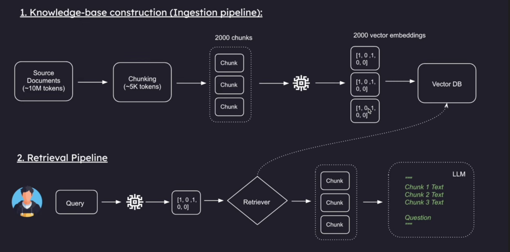

# 🤖 Club Chatbot — RAG Pipeline FULLY AI GENRATED i dont have time to do a readme

A Retrieval-Augmented Generation (RAG) chatbot for the Coding Ninjas 10X Club at SRM Institute of Science and Technology. It answers questions about the club using only verified club data — no hallucinations.

## Architecture



```
User Question
     │
     ▼
┌─────────────────────────┐
│  4_context_history.py   │  ← Rewrites vague follow-ups into standalone queries
│  (Conversation Memory)  │     using chat history
└────────────┬────────────┘
             │
             ▼
┌─────────────────────────┐
│  ChromaDB Vector Store  │  ← Searches for top K most relevant text chunks
│  (db/chroma_db)         │     using cosine similarity
└────────────┬────────────┘
             │
             ▼
┌─────────────────────────┐
│  OpenRouter LLM         │  ← Generates a grounded answer using ONLY
│  (openrouter/free)      │     the retrieved context
└─────────────────────────┘
```

### Pipeline Files

| File | Purpose |
|------|---------|
| `1_data_feeding_pipeline.py` | Loads `.txt` files → chunks them → embeds via OpenRouter → stores in ChromaDB |
| `2_data_retrieval_pipleine.py` | Connects to ChromaDB → retrieves top K relevant chunks for a query |
| `3_answer_generation.py` | Retrieves chunks + sends them to an LLM to generate an answer |
| `4_context_history.py` | Full chatbot with conversation memory, query rewriting, retrieval, and answer generation |

### Key Components

- **`OpenRouterEmbeddings`** — Custom LangChain `Embeddings` class that calls OpenRouter's `/embeddings` endpoint directly via `requests`, bypassing LangChain's strict OpenAI response parser.
- **`call_llm()`** — Sends chat messages to OpenRouter's `/chat/completions` endpoint using `openrouter/free` (auto-routes to a free model).
- **ChromaDB** — Local vector database. Stores text chunks as embedding vectors. Uses cosine similarity for search.

## Setup

```bash
# Clone the repo
git clone <repo-url>
cd Club_Chatbot

# Install dependencies
uv sync

# Add your OpenRouter API key
echo 'OPENROUTER_API_KEY=your_key_here' > .env

# Run the ingestion pipeline (only needed once)
uv run 1_data_feeding_pipeline.py

# Start the chatbot
uv run 4_context_history.py
```

## Tech Stack

- **Python 3.13** with `uv` for dependency management
- **LangChain** for document processing and vector store abstraction
- **ChromaDB** for local vector storage
- **OpenRouter** for free embeddings (`nvidia/llama-nemotron-embed-vl-1b-v2:free`) and free LLM inference (`openrouter/free`)

## Branch Rules

- **`main`** — Production. Do NOT push directly.
- **`dev`** — Development. Do NOT merge directly. Create pull requests.
- Feature branches → PR into `dev` → PR into `main`.

---

## Roadmap

### LLM Fallback Chain - 1 - C
- [ ] Add Mistral as a secondary LLM provider
- [ ] Add Groq as a tertiary LLM provider
- [ ] Add Ollama for local/offline fallback
- [ ] Implement automatic fallback logic: if provider A fails → try B → try C

### Better Dataset - 1 - {other domains}
- [ ] Expand `ClubQuestions.txt` with more detailed Q&A pairs
- [ ] Add separate `.txt` files for each domain (events, team structure, recruitment, etc.)
- [ ] Clean and normalize data formatting for better chunk quality
- [ ] Tune `chunk_size` and `chunk_overlap` for optimal retrieval

### Reranking (optional)
- [ ] Implement a reranker after initial retrieval (e.g., Cohere Rerank, cross-encoder)
- [ ] Retrieve more chunks (top 10-15) then rerank down to top 3-5
- [ ] Compare retrieval quality before and after reranking

### Hosting & API {everyone has to work together}
- [ ] Host the chatbot on Vercel as a serverless function
- [ ] Expose an OpenAI-compatible API format (`/v1/chat/completions`)
- [ ] Add API key authentication for the hosted endpoint
- [ ] Add rate limiting

### Code Quality 1 - A
- [ ] Make the codebase more efficient (reduce redundant API calls, batch embeddings)
- [ ] Add error handling and retries for API calls
- [ ] Add logging instead of print statements
- [ ] Write unit tests for core functions

---

## Learning Resources

All tutorials and notes are in the `notes+tutorials/` folder:

| File | What You'll Learn |
|------|-------------------|
| `basic-notes.md` | Core RAG concepts |
| `1_data_feeding_pipeline_tutorial.md` | How to build the ingestion pipeline |
| `2_data_retrieval_pipeline_tutorial.md` | How to build the retrieval pipeline |
| `4_context_history_tutorial.md` | How to build conversation memory |
| `working_of_cosine_similarity.md` | How vector search math works |

> **Tip:** Upload the tutorial files to [NotebookLM](https://notebooklm.google.com/) or paste them into any LLM for an interactive learning experience.
